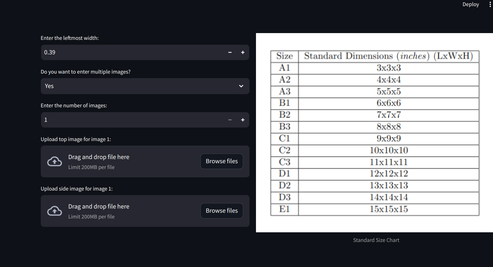
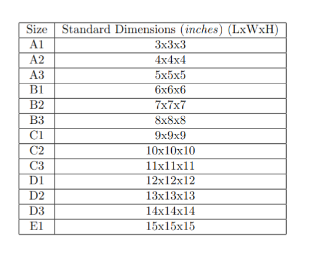
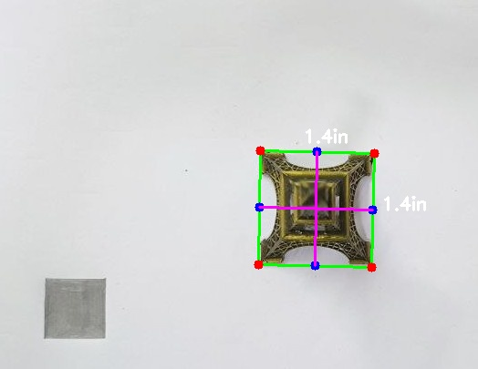
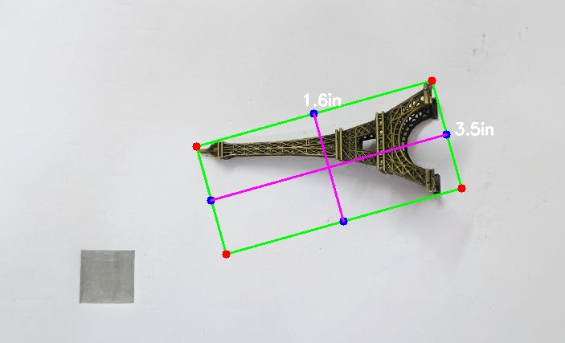

#  📦 `AutoPack - Computer Vision for Optimal Package Selection`

`AutoPack` is a computer vision-based tool designed to optimize package selection for various objects by predicting their dimensions and finding the most suitable packaging box. This project leverages Python's `OpenCV` library and `Scipy` to accurately determine object dimensions from images and automatically suggest the best-fitting box from a predefined list of available sizes.

## ✨ `Authors`

- **Akshit** ([@akshit11318](https://github.com/akshit11318))
- **Ankith** ([@ankith-3328](https://github.com/ankith-3328))
- **Ayush** ([@ayushadarsh7](https://github.com/ayushadarsh7))
- **Panshul**

## 🚀  `Key Features`

- **Dimension Prediction**: Utilizes computer vision techniques to predict the length, breadth, and height of objects based on top and side-view images.


- **Optimal Box Selection**: Automatically determines the best packaging box that can fit the object, taking into account different volume and size requirements.
- **Streamlit Integration**: User-friendly interface to upload images, input object parameters, and get packaging suggestions in real time.

- **Scalability**: Designed to handle a wide range of object sizes and packaging box dimensions.
- **Customization**: Allows users to add or remove packaging box sizes based on their specific needs.

- **Multiple Box Configurations**: Supports finding the optimal combination of boxes.
## 🚀 `Usage`

### Prerequisites

Before using this tool, make sure you have the following installed:
```bash
 Python 3.7 or higher
 OpenCV (`cv2`)
 NumPy
 Scipy
 Imutils
 Streamlit
```
### Running the Application

To run the  `Streamlit` application:

1. Clone the repository:

    ```bash
    git clone https://github.com/Akshit11318/AutoPack_Computer_Vision_for_Optimal_Package_Selection.git
    cd AutoPack_Computer_Vision_for_Optimal_Package_Selection
    ```

2. Install the required packages:

    ```bash
    pip install -r requirements.txt
    ```

3. Run the Streamlit application:

    ```bash
    streamlit run app.py
    ```

4. Upload the top and side images of the object, and input the known width of the leftmost object in the image.

5. The application will display the optimal box size and dimensions for your object.

### We also have the online version deployed on huggingface spaces 
[`hugging face repo`](https://huggingface.co/spaces/rudra11/AutoPack_Computer_Vision_for_Optimal_Package_Selection)
### Example

Upload images like the ones shown in the reference chart:

1. **Top View Image**: A clear image showing the top view of the object.


2. **Side View Image**: A side image that helps capture the object's height.

The app will calculate the object dimensions and suggest an appropriate box size.

## 🌟 `Code Highlights`

### Dimension Prediction

The `dim_predict` function is the core of the application, which processes the input images to predict the dimensions of the object. It uses the following steps:

- **Grayscale Conversion & Blurring**: Pre-process the image to simplify edge detection.
- **Edge Detection**: Detect edges using the Canny edge detector.
- **Contour Detection**: Identify contours and select the most appropriate one based on area.
- **Pixel Calibration**: Calculate pixels per metric unit using a known reference object.
- **Dimension Calculation**: Compute object dimensions by measuring contour distances.

### Optimal Box Selection

The tool uses the `find_optimal_box` function to determine the most suitable packaging box:

- **Volume Calculation**: Calculates the volume of the object and compares it with available boxes.
- **Box Selection**: Suggests the smallest box that can accommodate the object, considering additional free volume.

### Bin Packing Implementation

For scenarios involving multiple objects, the `find_min_bounding_box` function is employed:

- **Orientation & Positioning**: Calculates the best orientation and stacking position to minimize the bounding volume.

- **Overlap Detection**: Ensures no overlapping occurs between objects during the stacking process.

## 🤝 `Contributing`

We welcome contributions to improve AutoPack! Please feel free to submit issues, fork the repository, and open pull requests.


